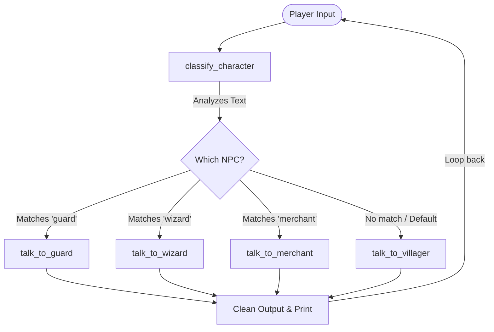

# AI Village

The code in `main.py` is a text-based game that allows the player
to converse with various AI fictional characters.  

Notice how a character is simply a call to the `chat` function, but with 
a string prepended to the chat parameter to instruct the AI to behave 
a certain way. This is what is known as **"prompting"** in AI.

## Fixing the bug

Inspect the main loop carefully. We are using a basic `while True`
loop and `input()` to get the player's message. Instead of asking the player exactly who 
they want to talk to, we use the function `classify_character()` to decide
from their raw input who they mean to talk to, and then we send that input
to the correct character. In software engineering, this architectural pattern is called a **router**.



The issue right now is that the router code doesn't work correctly, and we are almost always stuck talking to the villager. Fix this routing logic.

## Removing all the "thinking"

You'll notice that the `chat` function returns a raw string that includes how
the AI thinks before it answers. This internal monologue is enclosed between `<think>` and `</think>` tags.
Your users shouldn't see this! Use your knowledge of string manipulation and slicing to remove these thinking tags so the game's output is clean.

## More characters

If you look at the code inside `classify_character()`, you'll notice
we are prompting the AI to choose from 4 types of characters, but our main loop logic only actually handles 2 of them.
Modify the code to completely implement and handle all 4 character types (`villager`, `guard`, `wizard`, and `merchant`).

## Extending into different worlds

Using this pipeline structure, you can extend this game engine to any type of universe, genre, or scenario.
Make a copy of your completed `main.py` and call it `story.py`. Then, completely redesign the prompts, characters, and scenario to create your own unique custom text adventure!

You can then run your custom story by tying `python story.py` in the terminal.

# Submit

Once your program runs correctly, use `pytest` to verify your solution. 

Please note that I expect you to only use techniques covered in class up to chapter 8.
If are satisified, submit your assignment using Git commands.

```bash
git add -A
git commit -m 'submit'
git push
```

